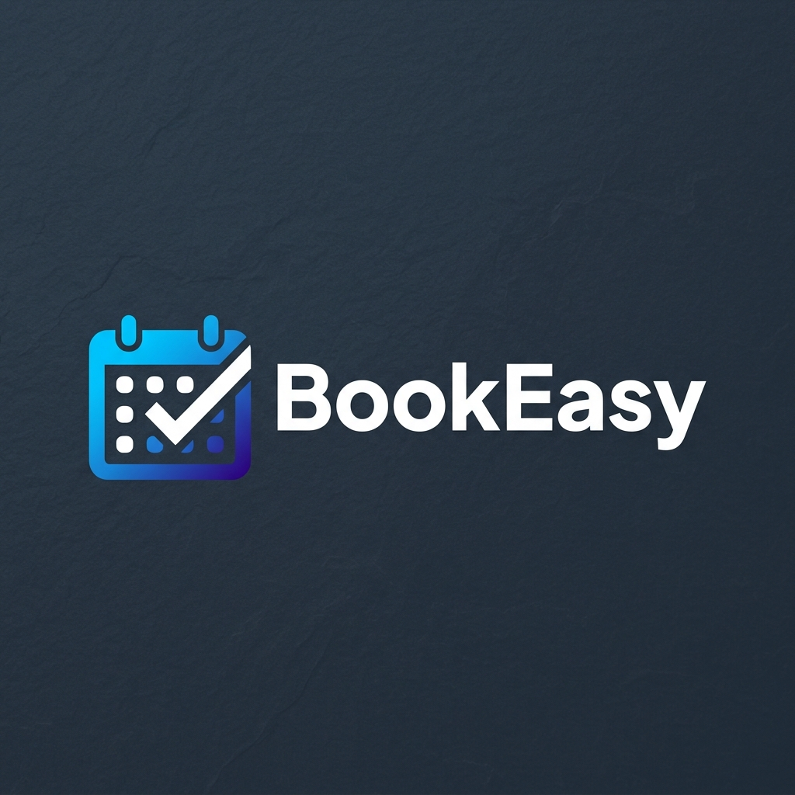
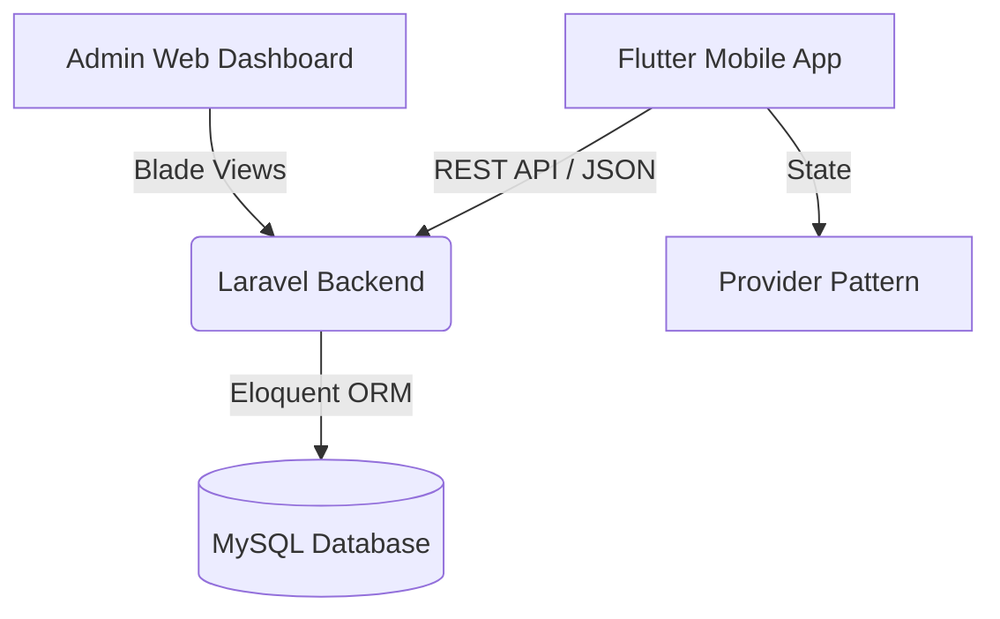

  

# BookEasy - Portfolio Documentation

## Business Problem
Service-based businesses (salons, clinics, consulting) often rely on manual booking systems, leading to double-bookings, no-shows, and poor customer experiences.

## The Solution
**BookEasy** digitizes the entire workflow. It gives the business owner a powerful Web Admin panel to manage staff, services, and schedules, while offering customers a frictionless Mobile App to book and manage their appointments.

## Architecture Diagram

## Database Design
* `users`: Authentication & Role management (Admin, Staff, Customer).
* `services`: Name, description, price, duration.
* `appointments`: Ties User + Service + Date/Time + Status.

## API Design
* Uses `Laravel Sanctum` for Bearer token authentication.
* RESTful JSON endpoints returning strictly typed models.
* Centralized validation parsing injected straight into the Flutter UI.

## Mobile App Design
* **State Management:** `Provider` pattern for highly decoupled business logic.
* **API Client:** Singleton custom network layer parsing 422 Validation exceptions dynamically.
* **Design System:** Indigo & Blue gradient, Material 3, fully responsive layouts.
