<div align="center">
  

  # BookEasy

  **Modern Appointment Booking Platform built with Laravel 12 & Flutter**
  
  <!-- Technology Badges -->
  [](https://laravel.com)
  [](https://flutter.dev)
  [](https://tailwindcss.com)
  [](https://www.mysql.com/)
  [](https://php.net)

</div>

---

## 📖 Overview

**BookEasy** is a full-stack appointment booking platform designed for service-based businesses. It provides a complete digital ecosystem comprising a responsive Laravel admin dashboard, a secure RESTful API, a customer booking website, and a native Flutter mobile application. 

| Category | Technology |
| :--- | :--- |
| **Backend** | Laravel 12 |
| **Mobile** | Flutter |
| **Database** | MySQL |
| **API** | REST API |
| **Authentication** | Laravel Sanctum |
| **UI** | Tailwind CSS & Alpine.js |
| **Architecture** | MVC + REST |
| **Responsive** | Yes |

---

## 🌟 Live Demo

Experience the live production deployment of BookEasy:

- **Live Website:** [https://bookeasy.esikalee.com](https://bookeasy.esikalee.com)
- **Admin Dashboard:** [https://bookeasy.esikalee.com/login](https://bookeasy.esikalee.com/login)

*(See the [Demo Credentials](#-demo-credentials) section below for access).*

---

## 💡 Why BookEasy?

This repository was engineered to demonstrate a production-ready approach to modern software architecture. Key takeaways include:

- **Full-Stack Development:** Seamlessly integrating a monolithic backend with decoupled client applications.
- **REST API Integration:** Exposing robust, secure endpoints for cross-platform consumption.
- **Authentication & Authorization:** Managing stateful web sessions alongside stateless API tokens via Laravel Sanctum.
- **Responsive Admin Dashboard:** A custom-built, lightweight CRM interface using Tailwind CSS.
- **Clean Architecture:** Strict adherence to MVC principles, robust Eloquent ORM usage, and separated routing logic.

---

## 🚀 Features

### Web Features
- **Responsive Booking Portal:** A mobile-first, friction-free booking experience for clients.
- **Admin Dashboard:** Centralized command center to manage the entire business operations.
- **Customer Management (CRM):** Detailed client histories, contact information, and appointment records.
- **Service Management:** Dynamic catalogs detailing service duration, pricing, and descriptions.
- **Dashboard Analytics:** Visual performance metrics using Chart.js.
- **Contact Workflows:** Interactive support forms with client-side validation.

### Mobile Features
- **Flutter Integration:** Fast, natively compiled application featuring Material Design 3 guidelines.
- **Self-Service Booking:** Select dates and available time slots directly from the device.
- **Booking History:** Track past visits and view upcoming reservations.
- **Profile Management:** Update personal details and account settings dynamically.

### API Features
- **Stateless Authentication:** Secure login using Laravel Sanctum API tokens.
- **RESTful Endpoints:** Standardized JSON responses for services, appointments, and user state.
- **Optimized Queries:** Eager loading and optimized payloads to minimize mobile latency.

---

## 📸 Web Application Screenshots

| Landing Page | Admin Dashboard |
| :---: | :---: |
| 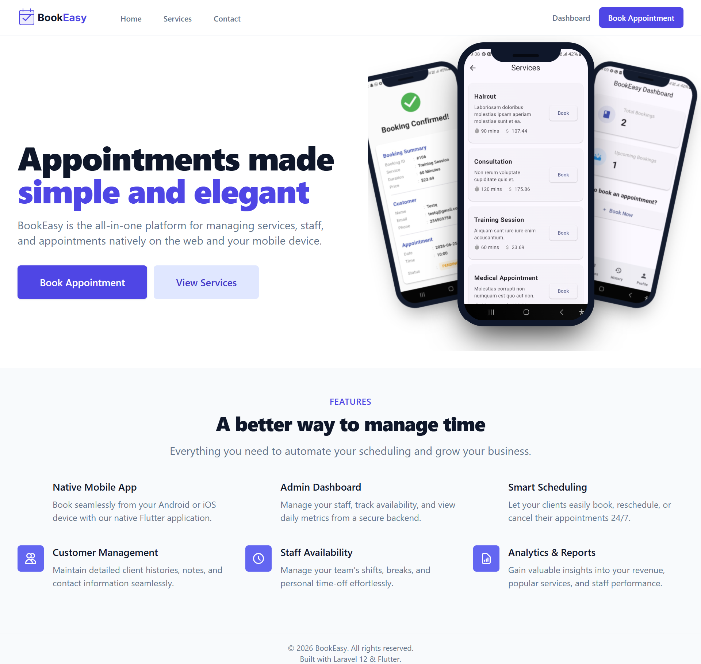 | 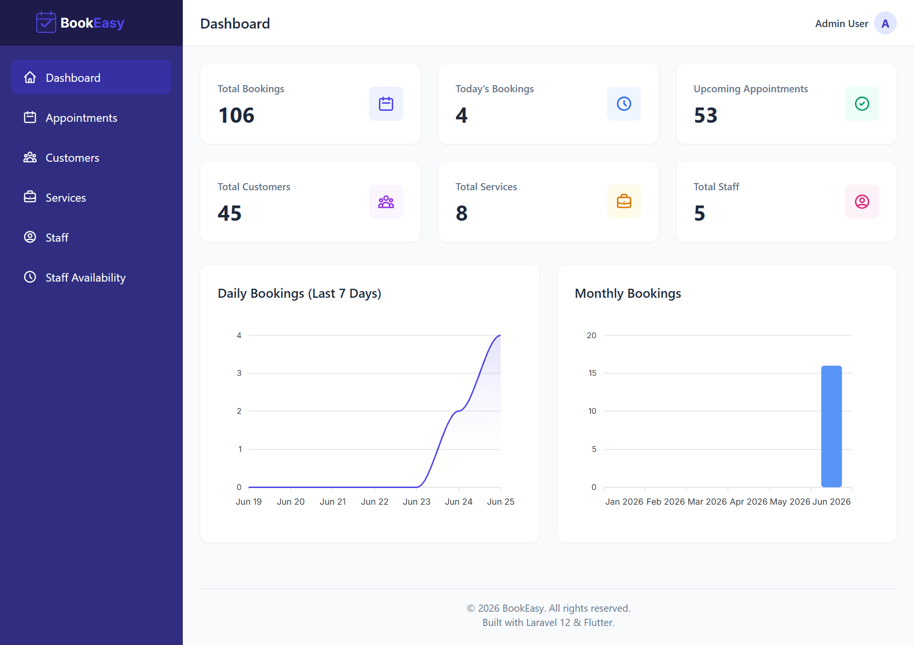 |
| *Premium SaaS landing page to drive conversions* | *Comprehensive analytics and daily metrics* |

| Appointments Management | Customer Database |
| :---: | :---: |
| 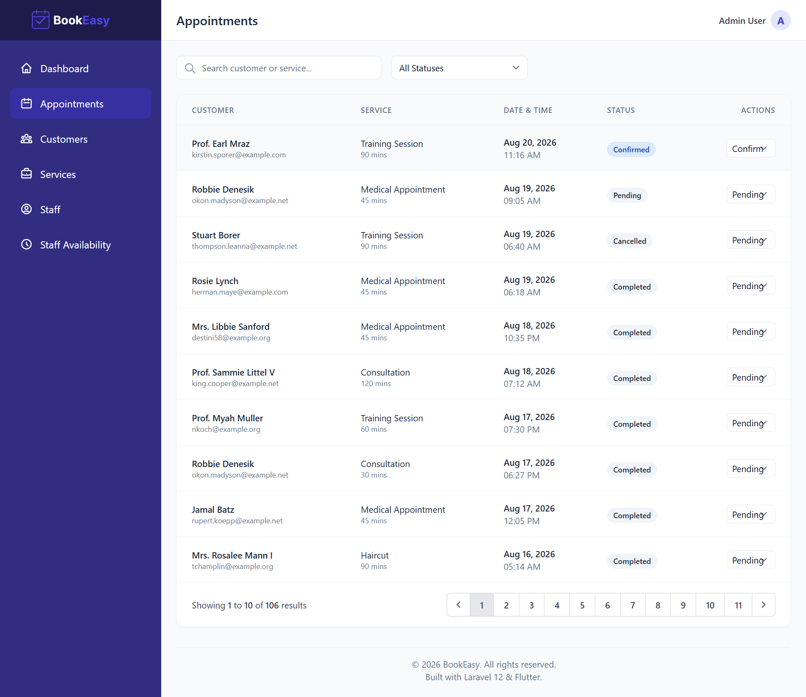 | 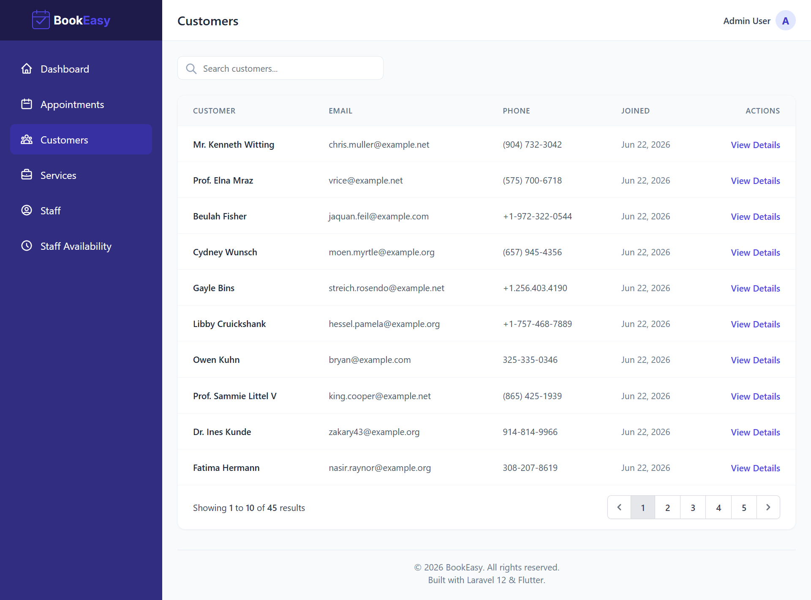 |
| *Intuitive calendar and booking oversight* | *Detailed client histories and contact data* |

| Service Catalog | Contact & Support |
| :---: | :---: |
| 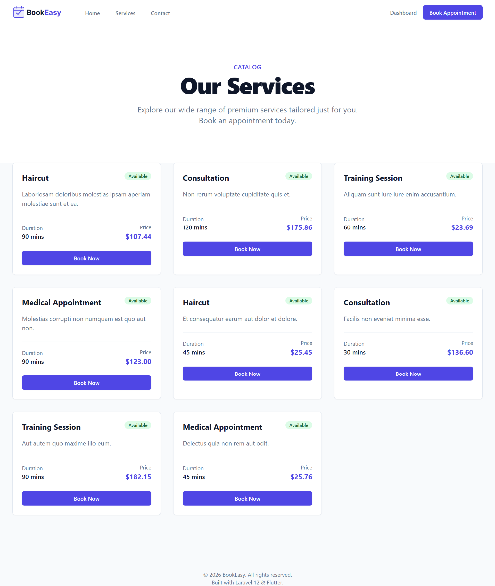 | 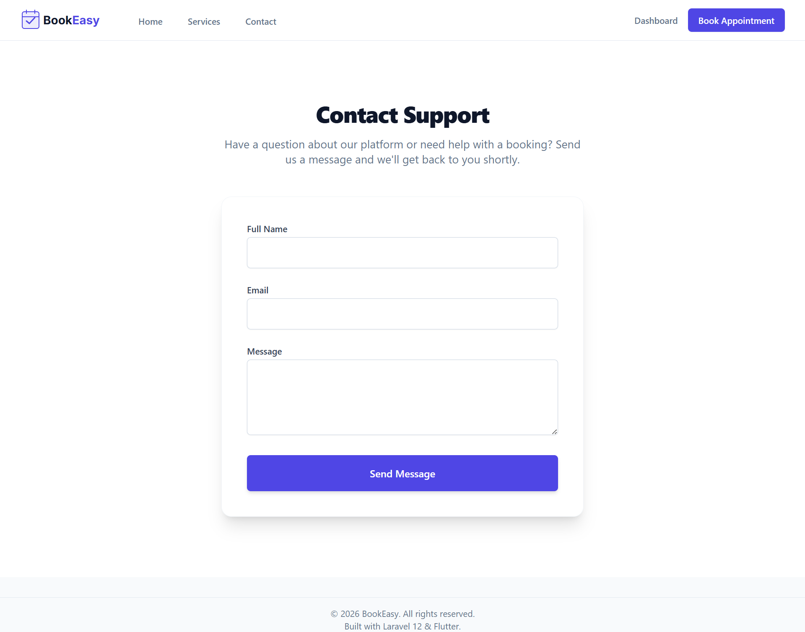 |
| *Manage pricing, durations, and categories* | *Interactive support forms with real-time validation* |

---

## 📱 Native Mobile App Screenshots

| Mobile Home | Services Catalog | Booking Workflow |
| :---: | :---: | :---: |
| 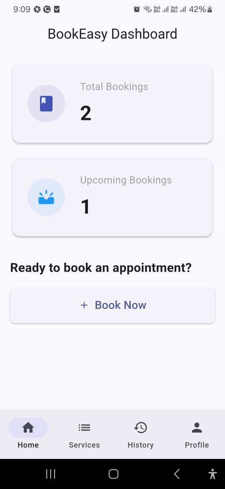 | 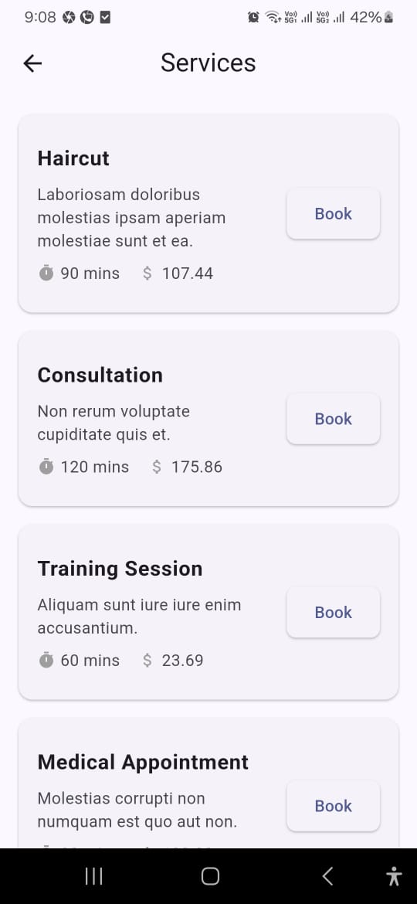 | 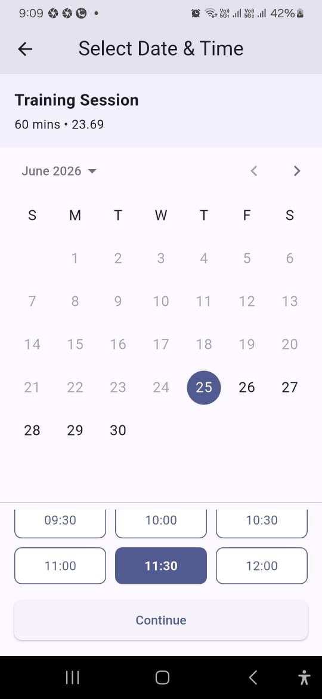 |
| *Sleek home dashboard* | *Browse available services* | *Select dates and time slots* |

| Booking Confirmation | Appointment History | User Profile |
| :---: | :---: | :---: |
| 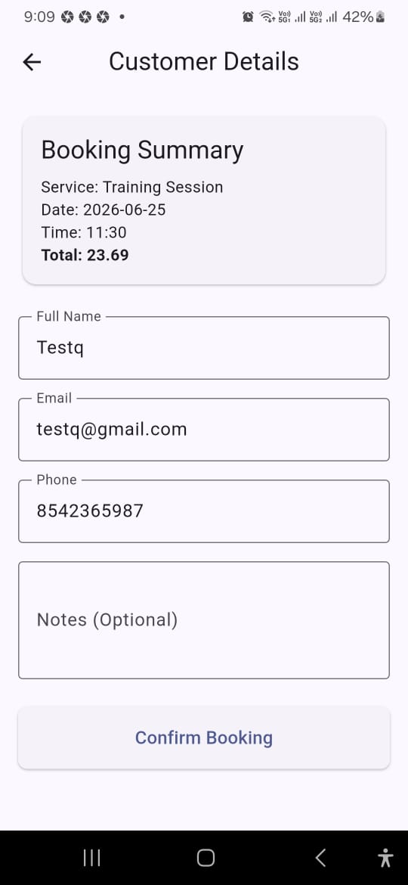 | 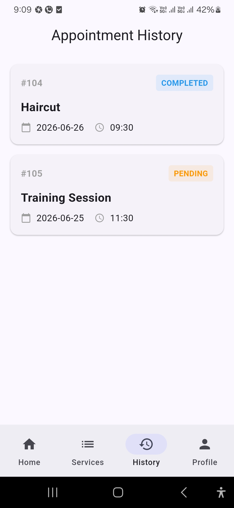 | 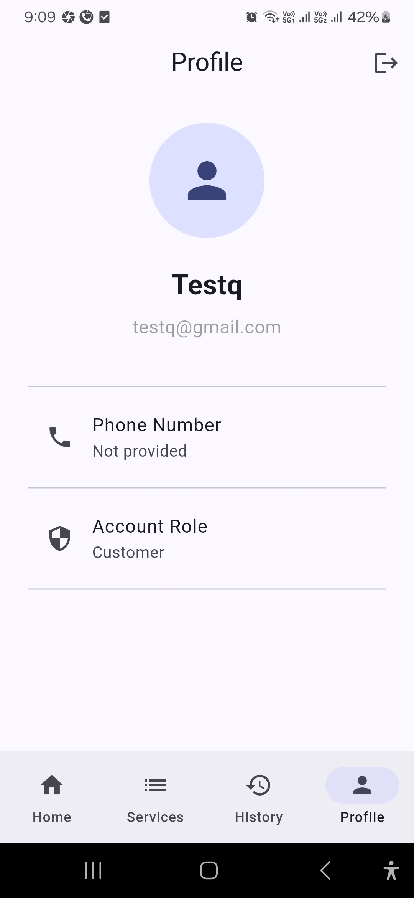 |
| *Instant booking summaries* | *Track past and upcoming visits* | *Manage account settings* |

---

## 🏗 Architecture

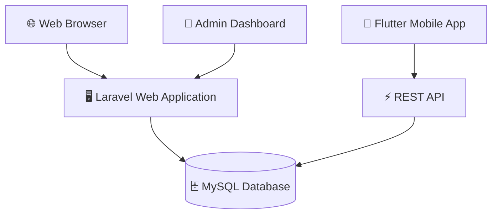

---

## 🛠 Technologies Used

- **Backend:** Laravel 12, PHP 8.2
- **Frontend:** Blade Templates
- **Mobile:** Flutter, Dart
- **Database:** MySQL
- **Authentication:** Laravel Sanctum (Token-based API + Stateful Sessions)
- **Styling:** Tailwind CSS
- **Interactivity:** Alpine.js
- **Charts:** Chart.js

---

## 📂 Project Structure

```text
BookEasy/
├── app/
│   ├── Http/
│   │   ├── Controllers/   # Web and API routing logic
│   │   └── Resources/     # API JSON transformation layers
│   └── Models/            # Eloquent ORM Definitions
├── database/
│   ├── migrations/        # Schema definitions
│   └── seeders/           # Database mock data
├── public/                # Compiled assets (CSS/JS) & images
├── resources/
│   └── views/             # Blade templating engine files
├── routes/
│   ├── web.php            # Frontend UI routes
│   └── api.php            # Mobile Flutter endpoints
└── BookEasy-Mobile/       # Native Flutter project
    ├── lib/
    │   ├── screens/       # Mobile UI layouts
    │   ├── models/        # Dart data classes
    │   └── services/      # REST API networking
    └── pubspec.yaml
```

---

## 🚀 Installation

Follow these instructions to set up the project locally.

1. **Clone the repository:**
   ```bash
   git clone https://github.com/NagaraniKaleeswaran/BookEasy.git
   cd BookEasy
   ```

2. **Install Backend Dependencies:**
   ```bash
   composer install
   npm install
   ```

3. **Environment Setup:**
   ```bash
   cp .env.example .env
   php artisan key:generate
   ```

4. **Database Configuration:**
   Configure your MySQL credentials in `.env` and run migrations:
   ```bash
   php artisan migrate:fresh --seed
   ```

5. **Build Assets & Serve:**
   ```bash
   npm run build
   php artisan serve
   ```

---

## 🔑 Demo Credentials

Use the following seeded credentials to explore the administrative dashboard:

| Role | Email | Password |
| :--- | :--- | :--- |
| **Administrator** | `admin@bookeasy.com` | `password` |

---

## 📱 Mobile Application

The `BookEasy-Mobile` directory contains the cross-platform Flutter application. It leverages **Material Design 3**, robust **REST API Integration**, and **Token-based Authentication**.

To run the mobile app locally (ensure your API base URL points to your local machine IP):
```bash
cd BookEasy-Mobile
flutter pub get
flutter run
```

---

## 🎨 Responsive Design

The entire web platform was built using a mobile-first approach with Tailwind CSS. The UI gracefully adapts across ultra-wide monitors, tablets, and mobile smartphones without compromising usability or aesthetic quality.

---

## 🗺 Future Roadmap

- [ ] Payment Gateway Integration
- [ ] Push Notifications
- [ ] Email Notifications
- [ ] SMS Notifications
- [ ] Google Calendar Sync
- [ ] Multi-tenant Support

---

## 📄 License

This project was created for portfolio and demonstration purposes.

Feel free to explore the source code and architecture.

Please contact the author before commercial use.

---

<div align="center">

Made with ❤️ using Laravel 12, Flutter and Tailwind CSS.

If you like this project, consider giving it a ⭐.

</div>
